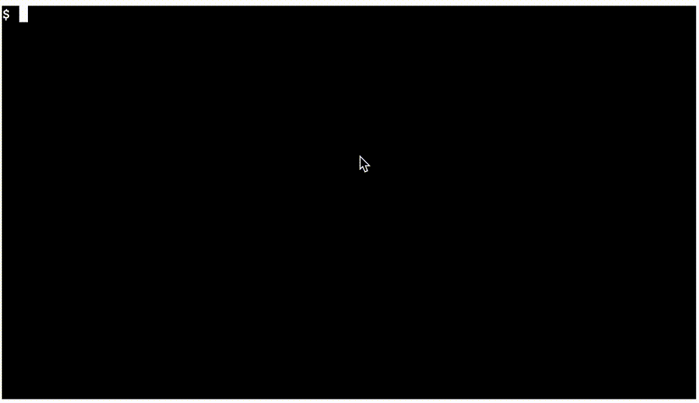

# `@wasmer/wasm-terminal`

A terminal-like component for the browser, that fetches and runs Wasm modules in the context of a shell. 🐚

Documentation for Wasmer-JS Stack can be found on the [Wasmer Docs](https://docs.wasmer.io/wasmer-js/wasmer-js).



## Table of Contents

- [Features](#features)
- [Installation](#installation)
- [Quick Start](#quick-start)
- [Wasm Terminal Reference API](#wasm-terminal-reference-api)
  - [WasmTerminal](#wasmterminal)
  - [fetchCommandFromWAPM](#fetchcommandfromwapm)
- [Browser Compatibility](#browser-compatibility)
- [Contributing](#contributing)

## Features

This project is built using [Xterm.js](https://github.com/xtermjs/xterm.js/), and [Comlink](https://github.com/GoogleChromeLabs/comlink) 🙏

- Runs WASI Wasm modules using [@wasmer/wasi](https://github.com/wasmerio/wasmer-js/tree/master/packages/wasi) and [@wasmer/wasmfs](https://github.com/wasmerio/wasmer-js/tree/master/packages/wasmfs). 🏃

- Provides a terminal-like experience, with stuff like autocomplete, hotkeys, pipes, and more! 👩‍💻

- Allows passing in your own custom Wasm binaries, or callback commands to provide commands in the shell! ⚙️

- Runs processes in seperate web workers using [Comlink](https://github.com/GoogleChromeLabs/comlink)! 🔗

- Exports a command fetcher for fetching packages from [WAPM](https://wapm.io/)! 📦

## Installation

For installing `@wasmer/wasm-terminal`, just run this command in your shell:

```bash
npm install --save @wasmer/wasm-terminal
```

## Quick Start

First, We must also include the `[xterm](https://github.com/xtermjs/xterm.js/).css`. For example:

```html
<!-- This includes the external stylesheet. NOTE: The path should point to wherever you are hosting the wasm-terminal output. -->
<link
  rel="stylesheet"
  type="text/css"
  href="./node_modules/@wasmer/wasm-terminal/lib/xterm/xterm.css"
/>
```


```javascript
import WasmTerminal, { fetchCommandFromWAPM } from "@wasmer/wasm-terminal";
import { lowerI64Imports } from "@wasmer/wasm-transformer";

// Let's write handler for the fetchCommand property of the WasmTerminal Config.
const fetchCommandHandler = async ({args}) => {
  let commandName = args[0];
  // Let's return a "CallbackCommand" if our command matches a special name
  if (commandName === "callback-command") {
    const callbackCommand = async (options, wasmFs) => {
      return `Callback Command Working! Options: ${options}, fs: ${wasmFs}`;
    };
    return callbackCommand;
  }

  // Let's fetch a wasm Binary from WAPM for the command name.
  const wasmBinary = await fetchCommandFromWAPM({args});

  // lower i64 imports from Wasi Modules, so that most Wasi modules
  // Can run in a Javascript context.
  return await lowerI64Imports(wasmBinary);
};

// Let's create our Wasm Terminal
const wasmTerminal = new WasmTerminal({
  // Function that is run whenever a command is fetched
  fetchCommand: fetchCommandHandler
});

// Let's print out our initial message
wasmTerminal.print("Hello World!");

// Let's bind our Wasm terminal to it's container
const containerElement = document.querySelector("#root");
wasmTerminal.open(containerElement);
wasmTerminal.fit();
wasmTerminal.focus();

// Later, when we are done with the terminal, let's destroy it
// wasmTerminal.destroy();
```

**NOTE:** Remember to include the CSS file mentioned at the beginning of the "Quick Start" section.

## Reference API

The Reference API Documentation can be found on the [`@wasmer/wasm-terminal` Reference API Wasmer Docs](https://docs.wasmer.io/integrations/js/reference-api/wasmer-wasm-terminal).

## Browser Compatibility

For more simple Wasm modules, E.g [cowsay](https://wapm.io/package/cowsay), the Wasm terminal will work on the latest version of all major browsers. However, more complex Wasm modules may only work on browsers that support [SharedArrayBuffer](https://developer.mozilla.org/en-US/docs/Web/JavaScript/Reference/Global_Objects/SharedArrayBuffer). Which was previously implemented in all major browsers, but was removed due to the [Meltdown and Spectre attacks](https://developer.mozilla.org/en-US/docs/Web/JavaScript/Reference/Global_Objects/SharedArrayBuffer#Browser_compatibility). Though, some major browsers have already started to re-enable this feature. The following cases that may be problemsome are:

- Wasm modules that infinitely loop like [wasm-matrix](https://github.com/torch2424/wasm-matrix). They will block the main thread and freeze the browser.

- Wasm modules that take in input from `/dev/stdin` such as [lolcat](https://wapm.io/package/lolcat). They will not take input from the shell. but instead, use [`window.prompt`](https://developer.mozilla.org/en-US/docs/Web/API/Window/prompt) to get input. Since `window.prompt` can pause the execution of javascript on the main thread for synchronous reads.

## Contributing

The project is split up around the relationship between a [terminal, tty, and shell](https://unix.stackexchange.com/questions/4126/what-is-the-exact-difference-between-a-terminal-a-shell-a-tty-and-a-con).

This project follows the [all-contributors](https://github.com/kentcdodds/all-contributors) specification.

Contributions of any kind are welcome! 👍
